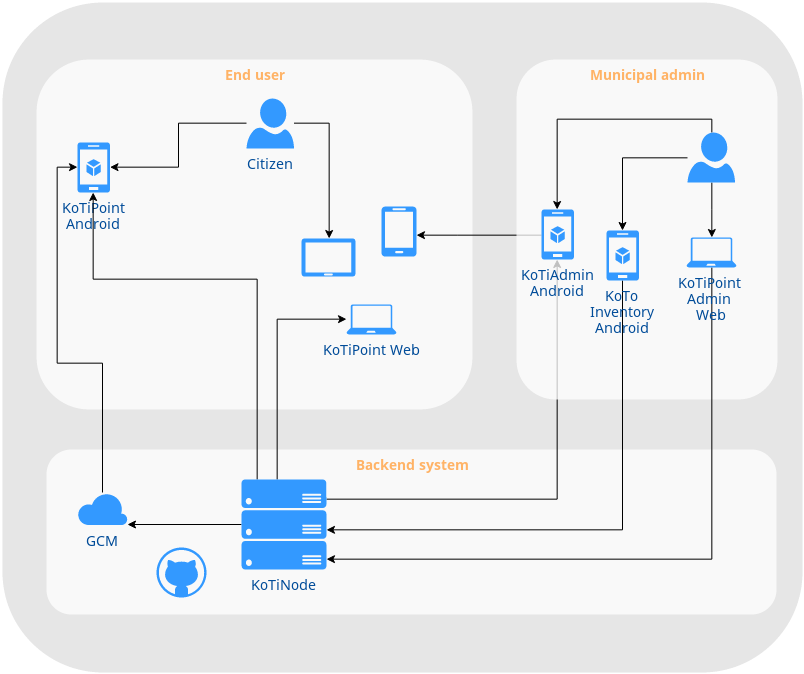

#KoTiNode server

KoTiNode is a server(REST API) and frontend intended to be server for all Kotomisak's mobile applications and also the related Web application.

Current version of KoTiNode is rather a skeleton for an API with following main TODO's:
- enhance REST API for [KoTiNode](https://github.com/kotomisak/koti-point-android) mobile app
- create scripts for mongodb
- use authentication (OAuth2) for secured access
- administration web for mobile app's data
- public face for the [Kotopeky](http://www.kotopeky.cz) and [Tihava](http://www.tihava.cz) willages
- ...

*Run using:*

0. alias mongo.start="mongod --dbpath /work/mongodb/"
1. npm start
2. NODE_ENV=prod node server.js (DEFAULT)
3. NODE_ENV=dev node server.js

Notice that we are sending the data as x-www-form-urlencoded. 
This will send all of our data to the Node server as query strings.